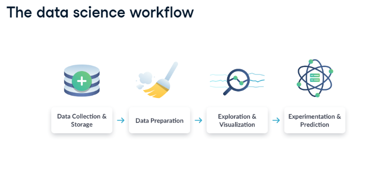
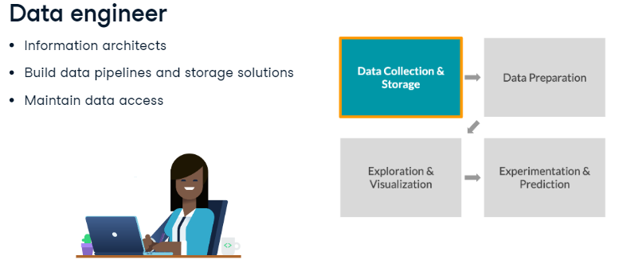
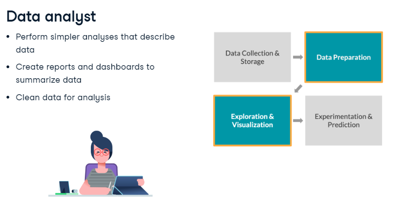
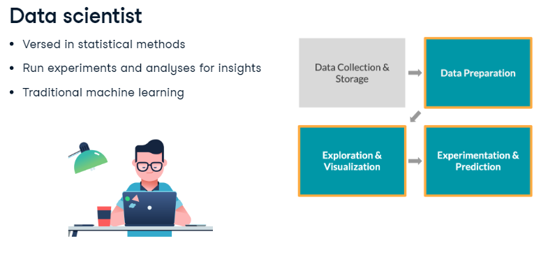
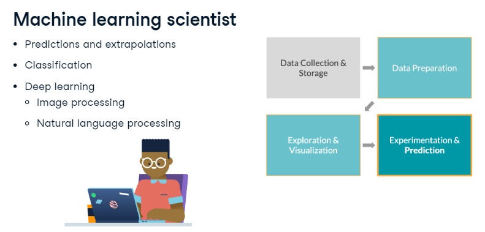
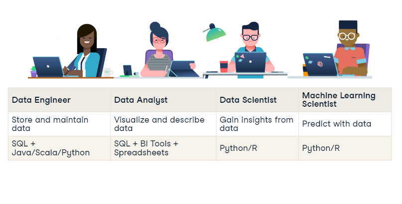

# Data science course by Muhammed Babar Ai

## Week 1: Introduction to Data Science 

### What is Data Science?

- Data science is a set methodologies, processes, architectures, and technologies that transform raw data into meaningful and useful information. It is a field that uses scientific methods, processes, algorithms and systems to extract knowledge and insights from structured and unstructured data.
- Data science is a multidisciplinary field that combines statistics, data analysis, machine learning, and domain knowledge to analyze and interpret complex data.
- Data science is used to solve complex problems, make decisions, and predict future outcomes using data.
- Data science is used in various industries such as healthcare, finance, marketing, retail, and more.
- Data science is a rapidly growing field with high demand for skilled professionals.
- Data science is a combination of data engineering, data analysis, and machine learning.
- Data science is a key component of artificial intelligence and big data analytics.
- Data science is a field that requires a combination of technical skills, domain knowledge, and problem-solving abilities.
- Data science is a field that requires continuous learning and adaptation to new technologies and methodologies.
- Data science is a field that offers a wide range of career opportunities and growth potential.
- Data science is a field that requires collaboration and teamwork to solve complex problems and achieve common goals.
- Data science is a field that requires ethical considerations and responsible use of data to ensure privacy, security, and fairness.

# example of data science real life

- data science is used in healthcare to predict patient outcomes, diagnose diseases, and improve treatment plans.
- data science is used in finance to detect fraud, predict market trends, and optimize investment strategies.
- 
## work flow of data science

### Data collection:
-  Collecting data from various sources such as databases, APIs, web scraping, sensors, and more.
### Data preprocessing: 
- Cleaning, transforming, and preparing the data for analysis.
### Exploratory data analysis:
- Exploring and visualizing the data to gain insights and identify patterns.
- Feature engineering: Creating new features or variables from the existing data to improve the performance of machine learning models.
### EXperimental,Prediction ,Testing and Deployment of model:
- Building and evaluating machine learning models to make predictions or classify data.

###  like this picture

# Data science are divided into 3 main categories
- Tridiational Machine Learning(ML)
- Deep Learning (Neural Networks)
- Internet of Things(IoT)

## There are four types of jobs in data science
- Data Engineer
- Data Analyst
- Data Scientist
- Machine Learning Engineer

## Dats Engineer role: 
- Detail next in class
- 

## Data Analyst role:
- Detail next in class
- 

## Data Scientist role:
- Detail next in class
- 

## Machine Learning Engineer role:
- Detail next in class
- 

## Final job,skill and workflow of data science 
- 

# Prerequisites for to Become a Data Scientist Beginner to Advance Level  **by Babar Ai**
 ## For data engineering:
- Programming languages: Python, Java, Scala, 
- Databases: SQL, NoSQL, Hadoop, Spark 
- Data processing: ETL, data pipelines, data warehousing 
- Cloud platforms: AWS, Google Cloud, Azure
- Big data technologies: Hadoop, Spark, Kafka, Hive, HBase
- Data engineering tools: Airflow, Luigi, Oozie, Azkaban 
- Data visualization: Tableau, Power BI, Looker 
- Data governance: data quality, data security, data privacy 

## For data analysis: 
- Programming languages: Python, R, SQL
- Data manipulation: pandas, dplyr, tidyr
- Data visualization: matplotlib, seaborn, ggplot2
- Statistical analysis: hypothesis testing, regression analysis, time series analysis
- Machine learning: scikit-learn, caret, xgboost
- Data analysis tools: Jupyter Notebook, RStudio, Google Colab
- Data storytelling: communicating insights, data visualization, dashboards
- Domain knowledge: understanding the business context, industry-specific data

## For data science:
- Programming languages: Python, R, SQL
- Data manipulation: pandas, dplyr, tidyr
- Data visualization: matplotlib, seaborn, ggplot2
- Statistical analysis: hypothesis testing, regression analysis, time series analysis
- Machine learning: scikit-learn, TensorFlow, PyTorch
- Deep learning: neural networks, convolutional neural networks, recurrent neural networks
- Natural language processing: text mining, sentiment analysis, chatbots
- Data science tools: Jupyter Notebook, RStudio, Google Colab
- Model evaluation: cross-validation, hyperparameter tuning, model selection
- Data science process: problem definition, data collection, data preprocessing, model building, model evaluation, model deployment
- Domain knowledge: understanding the business context, industry-specific data
- Communication skills: presenting findings, storytelling, data visualization, dashboards
- Collaboration skills: working in teams, sharing knowledge, peer review
- Continuous learning: keeping up with new technologies, methodologies, and best practices

## For machine learning engineering: 
- Programming languages: Python, Java, Scala 
- Machine learning frameworks: scikit-learn, TensorFlow, PyTorch 
- Deep learning frameworks: TensorFlow, PyTorch, Keras 
- Model deployment: Docker, Kubernetes, Flask, FastAPI,Django
- Cloud platforms: AWS, Google Cloud, Azure 
- Big data technologies: Hadoop, Spark, Kafka, Hive, HBase
- Data engineering: ETL, data pipelines, data warehousing
- Data visualization: Tableau, Power BI, Looker
- Model evaluation: cross-validation, hyperparameter tuning, model selection
- Model monitoring: tracking performance, detecting anomalies, retraining models
- Continuous integration/continuous deployment (CI/CD): automating the deployment process
- Domain knowledge: understanding the business context, industry-specific data
- Communication skills: presenting findings, storytelling, data visualization, dashboards
- Collaboration skills: working in teams, sharing knowledge, peer review
- Continuous learning: keeping up with new technologies, methodologies, and best practices
- Ethical considerations: responsible use of data, privacy, security, fairness
  
# Most Important Requirements Above 4 Fields Categories:
- Programming languages: Python, R, SQL,Scala 
- Mathematics: linear algebra, calculus, probability, statistics
- python libraries: pandas, numpy, matplotlib, seaborn, scikit-learn, TensorFlow, PyTorch
- Data visualization: matplotlib, seaborn, ggplot2, Tableau, Power BI, Looker
- Machine learning: scikit-learn, TensorFlow, PyTorch, xgboost, caret
- Deep learning: neural networks, convolutional neural networks, recurrent neural networks
- Natural language processing: text mining, sentiment analysis, chatbots
- Data engineering: ETL, data pipelines, data warehousing, Hadoop, Spark, Kafka, Hive, HBase
- Cloud platforms: AWS, Google Cloud, Azure
- Big data technologies: Hadoop, Spark, Kafka, Hive, HBase
- Data science process: problem definition, data collection, data preprocessing, model building, model evaluation, model deployment 

  # most important resources for data science
    - Books (Python for Data Analysis, Hands-On Machine Learning with Scikit-Learn and TensorFlow, Deep Learning, Natural Language Processing with Python)
    - Online courses (Coursera, Udemy, edX, DataCamp, Kaggle)
    - Blogs (Towards Data Science, Analytics Vidhya, KDnuggets, Data Science Central)
    - Podcasts (Data Skeptic, Linear Digressions, Talking Machines, Data Science at Home)
    - Conferences (ODSC, Strata Data Conference, Data Science Salon, AI Summit)
    - Hackathons (Kaggle, DrivenData, Analytics Vidhya, HackerRank)

  # Data Science Course by Babar Ai
    ## Week 1: Introduction to Data Science
    ## Week 2: Data Collection and Preprocessing
    ## Week 3: Exploratory Data Analysis
    ## Week 4: Feature Engineering
    ## Week 5: Machine Learning Basics
    ## Week 6: Supervised Learning
    ## Week 7: Unsupervised Learning
    ## Week 8: Deep Learning
    ## Week 9: Natural Language Processing
    ## Week 10: Computer Vision
    ## Week 11: Time Series Analysis
    ## Week 12: Model Evaluation and Deployment
    ## Week 13: Big Data and Cloud Computing
    ## Week 14: Data Science Project
    ## Week 15: Data Science Project Presentation
    ## Week 16: Final Exam and Certification
    ## Week 17: Job Placement and Career Development
    ## Week 18: Course Review and Feedback
    ## Week 19: Graduation Ceremony
    ## Week 20: Alumni Network and Continuing Education
    ## Week 21: Data Science Conference
    ## Week 22: Data Science Hackathon
    ## Week 23: Data Science Workshop
    ## Week 24: Data Science Bootcamp
    ## Week 25: Data Science Internship
    ## Week 26: Data Science Job Fair
    ## Week 27: Data Science Mentorship
    ## Week 28: Data Science Community
    ## Week 29: Data Science Blog
    ## Week 30: Data Science Podcast

# Conclusion
- Data science is a rapidly growing field with high demand for skilled professionals.
  

# Thank you for your attention and participation! 
#  see you in the next class InshaAllah

core pillars of data science
- Data Engineering
- Data Analysis
- Data Science
- Machine Learning Engineering
- 