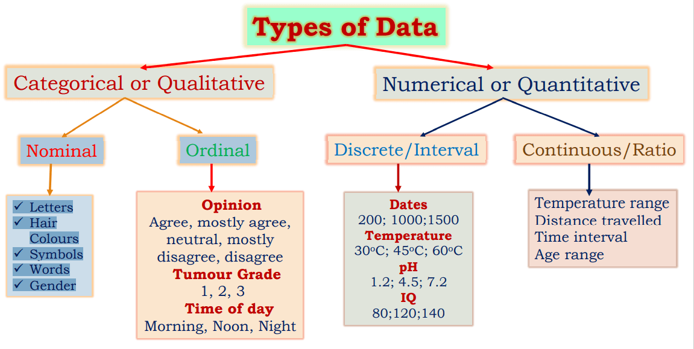
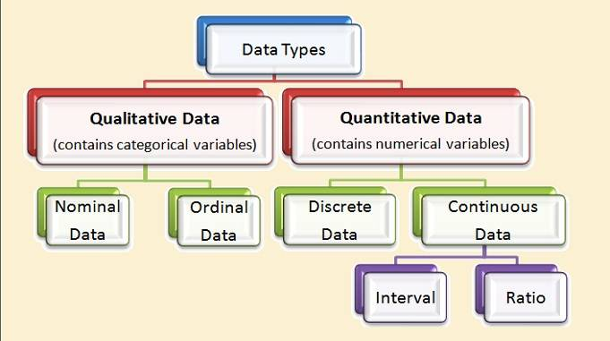

# Well Come to  Second Class of Week 1 of Data Science
# Today Agenda is:
- Introduction to Data
- Data Types


# INTRODUCTION TO DATA
- data is a collection of facts, such as numbers, words, measurements, observations or just descriptions of things.

# How can Collect Data ?
  # we can collect data in 2 ways
    - Primary Data or first hand data or field research data or original data 
    - Secondary Data or seconad hand data or desk research data or existing data or published data
 #   - Primary Data: Data collected by the investigator himself for a specific purpose.  
          - Example: Surveys, Interviews, Questionnaires, Focus Groups, Observations, Tests, Experiments, Measurements, Logs, Records, Databases, Technology
-   Primary data is the data that is collected by the researcher first hand. This type of data is new and original, because the researcher collects it himself.
-   primary data is costly and time consuming to collect, but it is more accurate and reliable.
-   primary data is also called first-hand data or field research data or original data.
-   primary often structured data

#   - Secondary Data: Data that has been collected by someone else for a different purpose.
          - Example: Books, Journals, Magazines, Newspapers, Websites, Blogs, Social Media, Forums, Databases, Technology
          - Secondary data is the data that has already been collected by and readily available from other sources.
          - Secondary data is less expensive and less time consuming to collect than primary data, but it is less accurate and reliable.
          - Secondary data is also called second-hand data or desk research data.
### let's see some examples of primary and secondary data collection methods
# problem: i need data about the population of pakistan
# Primary data collection methods
  - lets i am babar i need data about the population of pakistan
  - i can collect data by myself by going to every house and asking the number of people living in that house that is called primary data
  - it is costly and time consuming but it is more accurate and reliable data
# Secondary data collection methods
  - lets i am babar i need data about the population of pakistan
  - i can collect data from the internet or from the websites or from books,from newspaper  that is called secondary data
  - it is less expensive and less time consuming but it is less accurate and reliable data 
  - secondary data is often well structured data because it is already collected and organized by someone else


# After collction of data  to use Primary and Secondary Method we Categories Data into 2 Types
### -there are 2 fundamental types of data
  - Structured Data
  - Unstructured Data
#   - Structured Data: Data that is organized into a structured format, such as a table,liek tabular(row,colum) and with clear schema .
          - Example: Databases, Spreadsheets, Tables, CSV Files, XML Files, JSON Files
          - Structured data is easy to search, sort, filter, analyze, visualize,use, understand,interpts,work with,communiacte and present .
          - Structured data is also called quantitative data or numerical data.
          - Structured data is the most common type of data.
# let's see some examples of structured data
  - Example1```
    | Id |Name | Age |City |
    |----|-----|-----|-----|
    | 1  |Ali  | 25  |LHR  |
    | 2  |Ahmed| 30  |KHI  |
    | 3  |Sara | 22  |ISB  |
    | 4  |John | 35  |NYC  |
    | 5  |Emma | 28  |LON  | 
    ``` 

#   - Unstructured Data: Data that is not organized into a structured format, such as text, images, audio, video, or social media.
            - Example: Text Documents, Word Documents, PDF Documents, Images, Photos, Pictures, Audio Files, Music, Video Files, Movies, Social Media Posts, Social Media Comments, Social Media Messages
            - Unstructured data is difficult to search, sort, filter, analyze,visualize,understand,use and Present .
            - Unstructured data is also called qualitative data or textual data.
            - Unstructured data is the most common type of data.
# let's see some examples of unstructured data

    - Example1```
        -baabar,ali,25,lhr,ahmed,30,khi,sara,22,isb,john,35,nyc,emma,28,lon
    ```


# Now  this data can be further categorized into 2 types
### -there are 2 fundamental types of data
 ####  - Quantitative Data or Numerical Data or Structured Data
 #### - Qualitative Data or Categorical Data or Unstructured Data


#   - Quantitative Data: Data that is expressed as numbers, measurements, or quantities that can be counted or measured.
        -its answer the question how much or how many 
          - Example: Height, Weight, Age, Income, Price, Temperature, Speed, Distance, Time, Marks, Scores, Ratings, Counts
          - Quantitative data is easy to search, sort, filter, analyze, visualize, understand, use, and present.
          - Quantitative data is also called numerical data or structured data.
          - Quantitative data is the most common type of data.
    # Quantitative data can be further categorized into 2 types
      - Discrete Data / interval data
      - Continuous Data / ratio data
# Discrete Data: Data that is expressed as whole numbers or integers that cannot be further divided into smaller parts.
        - Example: Number of Students, Number of Cars, Number of Houses, Number of Books, Number of Computers, Number of Mobile Phones
        - Discrete data is easy to search, sort, filter, analyze, visualize, understand, use, and present.
        - Discrete data is also called count data or integer data.
        - Discrete data is the most common type of data.
  
# let's see some examples of discrete data
  - Example1```
    - Number of Students: 1, 2, 3, 4, 5
    - Number of Cars: 1, 2, 3, 4, 5
    - Number of Houses: 1, 2, 3, 4, 5
    - Number of Books: 1, 2, 3, 4, 5
    - Number of Computers: 1, 2, 3, 4, 5
    - Number of Mobile Phones: 1, 2, 3, 4, 5
    ```

# Continuous Data: Data that is expressed as real numbers or decimal numbers that can be further divided into smaller parts.
        - Example: Height, Weight, Age, Income, Price, Temperature, Speed, Distance, Time, Marks, Scores, Ratings
        - Continuous data is easy to search, sort, filter, analyze, visualize, understand, use, and present.
        - Continuous data is also called interval data or ratio data.
        - Continuous data is the most common type of data.
# let's see some examples of continuous data
  - Example1```
    - Height: 5.6, 5.8, 6.0, 6.2, 6.4
    - Weight: 50, 55, 60, 65, 70
    - Age: 20, 25, 30, 35, 40
    - Income: 5000, 6000, 7000, 8000, 9000
    - Price: 100, 200, 300, 400, 500
    - Temperature: 20, 25, 30, 35, 40
    - Speed: 50, 60, 70, 80, 90
    - Distance: 100, 200, 300, 400, 500
    - Time: 10, 20, 30, 40, 50
    - Marks: 50, 60, 70, 80, 90
    - Scores: 100, 200, 300, 400, 500
    - Ratings: 1, 2, 3, 4, 5
    - Counts: 1, 2, 3, 4, 5
    ``` 


#   - Qualitative Data: Data that is expressed as categories, labels, or descriptions that cannot be counted or measured numerically.
        Also called categoricaldata 
        Group into categories
        -its answer the question how or what
        definately not numbers
          - Example

          - Qualitative data is difficult to search, sort, filter, analyze, visualize, understand, use, and present.
        - Qualitative data is also called categorical data or unstructured data.
        - Qualitative data is the most common type of data.
        - Qualitative data can be further categorized into 2 types
          - Nominal Data
          - Ordinal Data
          - Nominal Data: Data that is expressed as categories, labels, or descriptions that cannot be ordered or ranked.

# let's see some examples of nominal data
  - Example
  - Nominal Data
  - Nominal Data: Data that is expressed as categories, labels, or descriptions that cannot be ordered or ranked.
  - Example1``Nominal data is a type of qualitative data that can be categorized into groups without any specific order or hierarchy. It labels variables without providing quantitative values. For example, male/female, alive/dead, blood group O, A, B, AB are all nominal variables. For nominal variables with more than two categories, the order does not matter


# Ordinal Data: Data that is expressed as categories, labels, or descriptions that can be ordered or ranked.
        - Example: Rating, Grade, Rank, Level, Satisfaction, Agreement, Likert Scale, Survey Scale, Star Rating, Priority
        - Ordinal data is easy to search, sort, filter, analyze, visualize, understand, use, and present.
        - Ordinal data is also called ordered data or ranked data.
        - Ordinal data is the most common type of data.

# let's see some examples of ordinal data
  - Example1``Ordinal data is a type of qualitative data that can be categorized into groups with some order or hierarchy. It labels variables with a specific order or ranking. For example, low/medium/high, small/medium/large, poor/fair/good/excellent, agree/neutral/disagree, 1st/2nd/3rd/4th are all ordinal variables. For ordinal variables, the order matters, but the difference between the categories is not defined.
  - Ordinal Data
  Ordinal data in statistics refers to data that has a natural order or ranking but the intervals between the values are not necessarily equal. Here are some examples of ordinal data:

1. **Educational Qualification**: Educational qualification can be categorized into ordinal levels such as elementary school, high school diploma, bachelor's degree, master's degree, and doctorate. These levels have a natural order, but the difference between each level is not necessarily the same.

2. **Likert Scale Responses**: Likert scale responses in surveys are often used to measure attitudes or opinions. Participants are asked to rate their agreement with a statement on a scale, such as "strongly disagree," "disagree," "neutral," "agree," and "strongly agree." While there is a clear order to these responses, the difference in opinion between "strongly disagree" and "disagree" may not be the same as the difference between "disagree" and "neutral."

3. **Economic Status**: Economic status can be categorized into ordinal levels such as lower class, middle class, and upper class. These categories have a natural order, but the difference in income or wealth between each level may not be uniform.

4. **Rankings in Competitions**: In sports competitions or academic rankings, participants are often assigned ordinal ranks such as first place, second place, third place, and so on. These rankings have a clear order, but the difference in performance between each rank may vary.

5. **Socioeconomic Status**: Socioeconomic status can be categorized into ordinal levels such as low, middle, and high. These categories have a natural order based on factors like income, education, and occupation, but the differences between each level may not be equal.

6. **Performance Ratings**: Performance ratings in job evaluations or academic assessments often use ordinal scales such as poor, fair, good, very good, and excellent. While these ratings have an inherent order, the difference in performance between each category may not be consistent.

Ordinal data is often analyzed using non-parametric statistical methods, as measures like means and standard deviations may not be meaningful due to the uneven intervals between categories. Instead, median, mode, percentiles, and rank-based methods are commonly used for analysis. Understanding the nature of ordinal data is essential for accurate interpretation and decision-making in various fields, including research, business, and policy development.


# let's see some examples of ordinal data
  - Example1```
    - Rating: 1, 2, 3, 4, 5
    - Grade: A, B, C, D, F
    - Rank: 1st, 2nd, 3rd, 4th, 5th
    - Level: Low, Medium, High
    - Satisfaction: Poor, Fair, Good, Very Good, Excellent
    - Agreement: Strongly Disagree, Disagree, Neutral, Agree, Strongly Agree
    - Likert Scale: 1, 2, 3, 4, 5
    - Survey Scale: 1, 2, 3, 4, 5
    - Star Rating: 1, 2, 3, 4, 5
    - Priority: Low, Medium, High
    ```


# full pic of data types


# an other pic of data types



# ###############################

# what is big data ?
- Big data is a term that describes the large volume of data – both structured and unstructured – that inundates a business on a day-to-day basis. But it’s not the amount of data that’s important. It’s what organizations do with the data that matters. Big data can be analyzed for insights that lead to better decisions and strategic business moves.
-Big data analytics is the process of collecting, processing, and analyzing large amounts of data to help organizations make better decisions. Big data is characterized by five V's: volume, velocity, variety, variability, and value. Data can come from a variety of sources, including web, mobile, email, social media, and networked smart devices


# five V's of big data 
- Volume: The amount of data.
- Velocity: The speed of data processing.
- Variety: The different types of data.
- Variability: The inconsistency of data coming from different sources.
- Value: The ability to turn data into value.
- Veracity: The quality of the data.


    